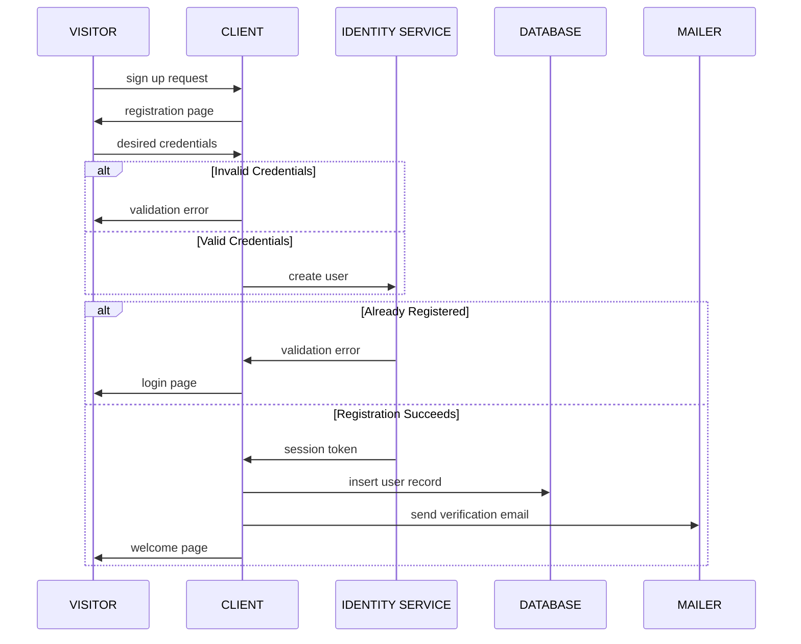

# Mermaid Markdown Examples

Mermaid Website: https://mermaid-js.github.io/mermaid/#/

## Sequence Diagrams

Documentation: https://mermaid-js.github.io/mermaid/#/sequenceDiagram

### New User Registration

